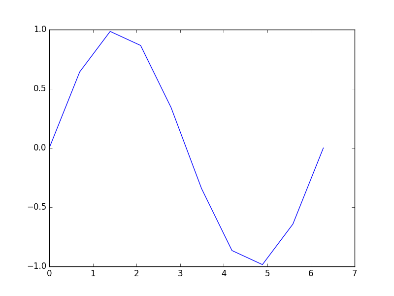
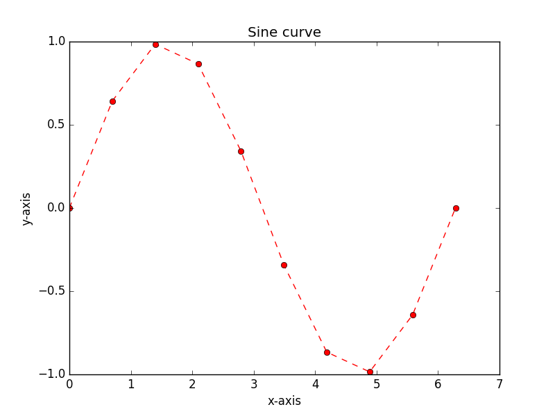

# Introduction to Python and NumPy, part I

## Sources
This tutorial is based on a combination of [a MATLAB tutorial from Prof. Todd Ehlers (Uni Tübingen)](http://www.geo.uni-tuebingen.de/arbeitsgruppen/mineralogie-geodynamik/geologie-geodynamik/ibm-documentation/matlab-tutorial.html) and the [Software Carpentry group's](http://software-carpentry.org/) lessons on [Programming with Python](http://swcarpentry.github.io/python-novice-inflammation/).

## Getting started
1. Since [Anaconda is likely installing in the background[(Anaconda.md)], you should open a second Terminal window by clicking on the Dash Home icon at the top left corner of the screen, typing `terminal` into the search box, and clicking on the Terminal icon. Alternatively, you can right click on the existing Terminal icon and select **New Terminal**.
2. I assume you have also already [downloaded and extracted the lesson data](Data.md), so you can navigate to the `Data` directory to start this lesson.

    ```bash
    $ cd ~/Desktop/Lab-1/Data
    ```
Note the `$` symbol represents the command prompt in the Terminal window.
3. Open a new IPython window.

    ```bash
    ipython
    ```

Now we are ready to start.

## Variables, arithmetic and libraries
We will start our Python lesson by learning a bit of the basic operations you can perform using Python.

1. Python can be used as a simple calculator.

    ```python
    >>> 1 + 1
    2
    >>> 5 * 7
    35
    ```

2. You can use Python for more advanced math by using *functions*. Functions are pieces of code that perform a single action such as printing information to the screen (e.g., the `print()` function). Functions exist for a huge number of operations in Python.

    ```python
    >>> sin(3)
    Traceback (most recent call last):
      File "<stdin>", line 1, in <module>
    NameError: name 'sin' is not defined
    >>> sqrt(4)
    Traceback (most recent call last):
      File "<stdin>", line 1, in <module>
    NameError: name 'sqrt' is not defined
    ```

    Wait, what? Python can't calculate square roots or do basic trigonometry? Of course it can, but we need one more step.

3. The list of basic arithmetic operations that can be done by default in Python is in the table below.

    | Operation      | Symbol | Example syntax | Returned value |
    | -------------- | ------ | ---------------|----------------|
    | Addition       | `+`    | `2 + 2`        | `4`            |
    | Subtraction    | `-`    | `4 + 2`        | `2`            |
    | Multiplication | `*`    | `2 * 3`        | `6`            |
    | Division       | `/`    | `4 / 2`        | `2`            |
    | Exponentiation | `**`   | `2**3`         | `8`            |
For anything more advanced, we need to load a *library*.

    ```python
    >>> import math
    >>> math.sin(3)
    0.1411200080598672
    >>> math.sqrt(4)
    2.0
    ```
A *library* is a group of code items such as functions that are related to one another. Libraries are loaded using `import`. Functions that are part of the library `libraryname` could then be used by typing `libraryname.functionname()`. For example, `sin()` is a function that is part of the `math` library, and used by typing `math.sin()` with some number between the parentheses.
4. Functions can also be combined.

    ```python
    >>> print(math.sqrt(4))
    2.0
    >>> print('The square root of 4 is',math.sqrt(4))
    The square root of 4 is 2.0
    ```

5. *Variables* can be used to store values calculated in expressions and used for other calculations.

    ```python
    >>> weight_kg = 55
    >>> print(weight_kg)
    55
    >>> print('weight in pounds:', 2.2 * weight_kg)
    weight in pounds: 121.0
    ```
Above, we also see one common format for *good* variable naming, separation of words by underscores `_` (e.g., `weight_kg`). This is called pothole_case_naming. We'll see another below.

6. Values stored in *variables* can also be updated.

    ```python
    >>> weight_kg = 57.5
    >>> print('weight in kilograms is now:', weight_kg)
    weight in kilograms is now: 57.5
    >>> WeightInPounds = 2.2 * weight_kg
    >>> print('weight in kilograms:', weight_kg, 'and in pounds:', WeightInPounds)
    weight in kilograms: 57.5 and in pounds: 126.5
    ```
An alternative to naming variables using pothole_case_naming is to use capital letters for each word with no spaces between (e.g., `WeightInPounds`). This is called CamelCaseNaming. Both options are easy to read and help you use *good* variable names. After all, *people* should be able to easily understand what different variables contain :+1:.

7. Note that changing the values of a variable does not affect those of other variables.

    ```python
    >>> weight_kg = 100.0
    >>> print('weight in kilograms is now:', weight_kg, 'and weight in pounds is still:', WeightInPounds)
    weight in kilograms is now: 100.0 and weight in pounds is still: 126.5
    ```

8. One of nice options in IPython is that you can see which variables are in memory by typing `whos`.

    ```python
    >>> whos
    Variable         Type     Data/Info
    -----------------------------------
    WeightInPounds   float    126.50000000000001
    weight_kg        float    100.0
    ```

9. There are 4 basic *data types* in Python as shown in the table below.

    | Data type name | Data type            | Example         |
    | -------------- | -------------------- | --------------- |
    | `int`          | Whole integer values | `4`             |
    | `float`        | Decimal values       | `3.1415`        |
    | `str`          | Character strings    | `'Korvapuusti'` |
    | `bool`         | True/false values    | `True`          |
The data types are displayed when using `whos`, but can also be found using the `type()` function. As you will see, the data types are important because some are not compatible with one another.

    ```python
    >>> FavoriteTreat = 'Korvapuusti'
    >>> type(FavoriteTreat)
    str
    >>> type(WeightInPounds)
    float
    >>> WeightInPounds = WeightInPounds + 100.0 * FavoriteTreat
    Traceback (most recent call last):
      File "<stdin>", line 1, in <module>
    TypeError: can't multiply sequence by non-int of type 'float'
    ```

## Introducing NumPy
NumPy is a library for Python designed for efficient scientific computing. Here, we'll get a sense of a few things NumPy can do.

1. To start using the NumPy library we will need to `import` it.

    ```python
    >>> import numpy as np
    >>>
    ```
Note that we've imported NumPy a bit differently this time. The `import library as` syntax can be used to give the library a different name in memory. Since we may want to use NumPy many time, shortening `numpy` to `np` is helpful.

2. Now we'll import an example data file.

    ```python
    >>> data = np.loadtxt(fname='GVP-Volcano-Lat-Lon-Elev.csv', delimiter=',')
    >>> print (data)
    [[  2.10010000e+05   5.01700000e+01   6.85000000e+00   6.00000000e+02]
     [  2.10020000e+05   4.57750000e+01   2.97000000e+00   1.46400000e+03]
     [  2.10030000e+05   4.21700000e+01   2.53000000e+00   8.93000000e+02]
     ...,
     [  3.90812000e+05  -7.34500000e+01   1.65500000e+02   2.60000000e+03]
     [  3.90829000e+05  -6.41500000e+01  -5.77500000e+01   1.63000000e+03]
     [  3.90847000e+05  -6.20200000e+01  -5.76700000e+01   5.49000000e+02]]
    ```
The data above is probably not very clear at this point, but is an example of data from the Smithsonian Institution's Global Volcanism Program. In this case, we have the ID number, latitude, longitude and elevation of Holocene volcanoes in the database. Let's see what we can do with this information.

3. First off, you may notice we've used NumPy to read in the data. What does that mean for us?

    ```python
    >>> type(data)
    numpy.ndarray
    ```
OK, so we have something new here. NumPy has its own data types that are part of the library. In this case, our data is stored in an NumPy *n*-dimensional array.

4. How much data do we have in our `data` variable?

    ```python
    >>> print(data.shape)
    (1532, 4)
    ```
1532 rows of data, 4 columns. `shape` is a *member* or *attribute* of `data`, and is part of any NumPy `ndarray`. Printing `data.shape` tells us the size of the array.

5. Within the array, we can find any value by using it's *indices*.

    ```python
    >>> data[0,0]
    210010.0
    ```
This gives us the value stored in the first row and first column of `data`. Note that to refer to a location in an array you should use the square brackets `[ ]`. In addition, index values **start at zero, not one**, and the first row and column refers to the top left value in the array. What will happen if we try to find `data[1532,0]`? Try it!

6. 1532 volcanoes is quite a few to deal with at the same time. We can explore our data more easily by using *index slicing* to extract part of the array. Let's start with just the latitude and longitude for the first five rows.

    ```python
    >>> data[0:5, 1:3]
    array([[ 50.17 ,   6.85 ],
           [ 45.775,   2.97 ],
           [ 42.17 ,   2.53 ],
           [ 38.87 ,  -4.02 ],
           [ 43.25 ,  10.87 ]])
    ```
Nice! Note that in this case, the range of index values for the first 5 rows is 0-5. The data extracted will start at `0` and go up to, but not include `5`. Be careful with this. We can also extract data for all columns without listing any index range at all.

    ```python
    >>> data[0:2, :]
    array([[  2.10010000e+05,   5.01700000e+01,   6.85000000e+00,
              6.00000000e+02],
          [  2.10020000e+05,   4.57750000e+01,   2.97000000e+00,
              1.46400000e+03]])
    ```
This, obviously, can be useful.

7. It is common to need to create your own arrays not from a data file, but to make a variable that has a range from one value to another. If we wanted to calculate the `sin()` of a variable `x` at 10 points from zero to 2 * pi, we could do the following.

    ```python
    >>> x = np.linspace(0., 2 * np.pi, 10)
    >>> print(x)
    [ 0.          0.6981317   1.3962634   2.0943951   2.7925268   3.4906585
      4.1887902   4.88692191  5.58505361  6.28318531]
    >>> y = np.sin(x)
    >>> print(y)
    [  0.00000000e+00   6.42787610e-01   9.84807753e-01   8.66025404e-01
       3.42020143e-01  -3.42020143e-01  -8.66025404e-01  -9.84807753e-01
      -6.42787610e-01  -2.44929360e-16]
    ```
    In this case, `x` starts at zero and goes to 2 * pi in 10 increments. Alternatively, if we wanted to specify the size of the increments for a new variable `x2`, we could use the `np.arange()` function.

    ```python
    >>> x2 = np.arange(0.0, 2 * np.pi, 0.5)
    >>> print(x2)
    [ 0.   0.5  1.   1.5  2.   2.5  3.   3.5  4.   4.5  5.   5.5  6. ]
    ```
    In this case, `x2` starts at zero and goes to the largest value that is smaller than 2 * pi by increments of 0.5. Both of these types of array options are useful in different situations.

8. Like normal variables, array variables can also be used for various mathematical operations.
    ```python
    >>> doublex = x * 2.0
    >>> print(doublex)
    [  0.           1.3962634    2.7925268    4.1887902    5.58505361
       6.98131701   8.37758041   9.77384381  11.17010721  12.56637061]
    ```

9. In addition to the *attributes* we saw prevously for NumPy `ndarray` variables, there are built-in functions that are part of the `ndarray` data type. These built-in functions are called *methods*.

    ```python
    >>> print(x.mean())
    3.14159265359
    >>> print(doublex.mean())
    6.28318530718
    ```
    No surprises here. If we think of *variables* as nouns, *methods* are verbs, actions for the variable values. NOTE: When using methods, you always include the parentheses `()` to be clear we are referring to a *method* and not an *attribute*. There are many other useful `ndarray` methods, such as `x.min()`, `x.max()`, and `x.std()` (standard deviation).

10. *Methods* can also act on part of an array.

    ```python
    >>> print(x[0:5].mean())
    1.3962634016
    ```

## Plotting in Python with Matplotlib
Python has a nice plotting library called Matplotlib, which is designed to provide MATLAB-like plotting in Python.

1. We can start by importing the Matplotlib plotting library.

    ```python
    import matplotlib.pyplot as plt
    ```
You may see a few messages, but don't worry about them. Note here that we have imported Matplotlib's Pyplot library as `plt`.

2. Let's start with a simple example using our old variables `x` and `y`.

    ```python
    >>> plt.plot(x, y)
    [<matplotlib.lines.Line2D at 0x109e25898>]
    >>> plt.show()
    ```
This should produce a plot like the one below.

    
A bit easier to visualize the array data rather than looking at the values themselves.
2. We can make our plots a bit nicer by using a few additional Matplotlib options.

    ```python
    >>> plt.plot(x, y, 'ro--')
    [<matplotlib.lines.Line2D at 0x10bd249e8>]
    >>> plt.title('Sine curve')
    <matplotlib.text.Text at 0x10b0af320>
    >>> plt.xlabel('x-axis'); plt.ylabel('y-axis')
    <matplotlib.text.Text at 0x10b08df98>
    >>> plt.show()
    ```
This should produce the plot below.

    

Now we see our sine curve as a red dashed line with circles showing the points along the line. This comes from the additional `ro--` used with `plt.plot()`. In this case, `r` tells it to use red color, `o` tells it to show circles at the points and `--` says to use a dashed line. You can use `help(plt.plot)` to find out more about formatting plots. We have also added a title and axis labels.
3. Adding text to plots can be done using the `plt.text()` function.

    ```python
    >>> plt.text(2.0, 0.0, 'Here is some text')
    ```
This would add the text "Here is some text" at the location x=2.0, y=0.0 on the plot. You will need to do `plt.show()` again to update the plot.
4. Changing the plot axes can be done using the `plt.axis()` function.

    ```python
    >>> plt.axis([0.0, np.pi, 0.0, 1.0])
    ```
The format for `plt.axis()` is `[xmin, xmax, ymin, ymax]` enclosed in square brackets. Here, the x range would be changed to 0-pi and the y range would be 0-1.

## Getting help
You can get help on the different Python functions using the `help()` function.

1. Other than using Google, the easiest way to get help in Python is to use the `help()` function as shown below.

    ```python
    >>> help(plt.plot)
    Help on function plot in module matplotlib.pyplot:

    plot(*args, **kwargs)
    ...
    ```
This brings up a documentation browser for whatever function you give to `help`. You can scroll up and down with the arrows and exit the documentation browser by typing `q`.
